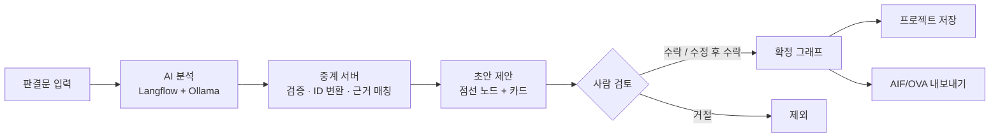
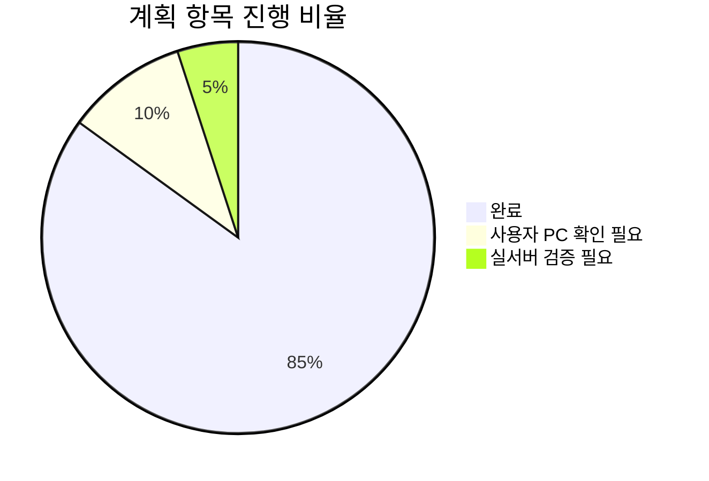
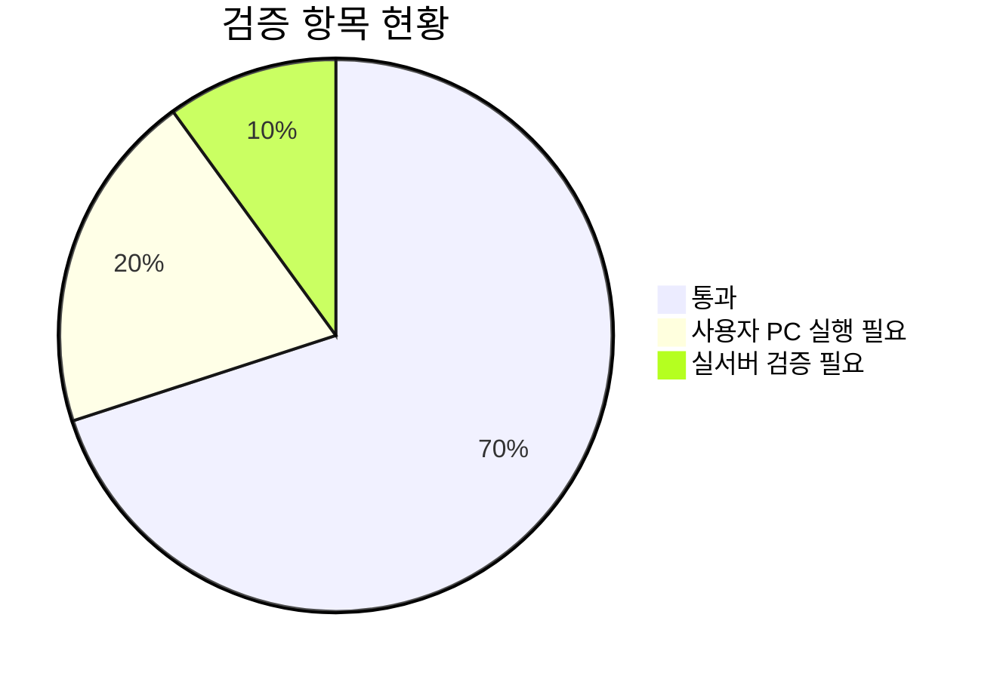

# Langflow 연동 · AI 논증 검토 UI — 진행 보고

- 작성일: 2026-09-11
- 대상: 법률 논증 시각화 사이트에 AI 분석·검토 기능 추가
- 원칙: 기존 프로젝트는 손대지 않고 별도 복사본에서 구현

## 1. 전체 흐름



- AI 는 초안만 제시, 최종 확정은 사람이 수행 (Label Studio pre-annotation 방식)
- 확정 그래프에는 수락된 항목만 포함, 미검토·거절 항목은 내보내기에서 제외

## 2. 참고한 annotation 도구 조사

- 초반에 AI 결과를 사람이 검토하는 annotation 자동화 UI 조사
- 대부분 텍스트 분류 · 개체명 라벨링 중심이라 논증 그래프(노드·관계·근거) 검토에는 그대로 맞지 않음
- 설치·임베딩 없이 검토 흐름과 UI 패턴만 참고, 기존 React 그래프 편집 기능 위에 직접 구현

| 도구 | 성격 | 참고한 점 | 채택 여부 |
| --- | --- | --- | :---: |
| Label Studio | 범용 라벨링, 모델 예측(pre-annotation) 검토 | AI 초안과 확정 결과 분리, 수락 · 수정 · 거절 흐름 | 방식 채택 |
| doccano | 텍스트 분류 · 시퀀스 라벨링 | 간단한 원문 범위 선택 · 라벨 편집 UI | 부분 참고 |
| INCEpTION | 문서 annotation, 추천 검토 | 원문에 연결된 추천 항목 검토 방식 | 부분 참고 |

## 3. 단계별 진행 현황

| 단계 | 내용 | 상태 | 진행도 |
| --- | --- | :---: | :---: |
| 1 | 원본 복사 · 해시 기록 · 기준선 검사 | 복사 완료, 기준선 검사만 남음 | 80% |
| 2 | 중계 서버 · Langflow 연결 · 실행 상태 UI | 완료 (mock 기준) | 100% |
| 3 | 근거 인용 flow · 원문 위치 매칭 · 하이라이트 연동 | 완료 | 100% |
| 4 | 수락·수정·거절 · 저장 · 내보내기 · 되돌리기 | 완료 | 100% |
| 5 | 최종 검증 · 문서 · 전달 | 자동 검사 완료, 브라우저·실서버 확인 남음 | 60% |



## 4. 구현 내용

### 4-1. 중계 서버

| 기능 | 내용 |
| --- | --- |
| 분석 실행 | 접수 → 대기 → 실행 → 성공/실패/취소 상태 관리, 동시 실행 제한, 중복 클릭 방지 |
| Langflow 호출 | 판결문을 flow 의 입력 컴포넌트로 전달, 지정된 출력 컴포넌트 결과만 사용 |
| 응답 검증 | 잘못된 JSON · 누락 필드 · 중복 ID · 없는 노드 참조 차단 |
| 데이터 정리 | 실행별 노드 ID 부여, 결과 문서에 사건 ID 대신 원문 보존 |
| 근거 매칭 | 인용문의 원문 위치 확인 (일치 / 공백 차이 / 위치 불명확 / 없음) |
| 저장 | 실행 기록과 프로젝트를 로컬 DB 에 보존, 동시 수정 충돌 검사 |
| 보안 | API 키는 서버에만 보관, 로그에 판결문·키 미기록 |

### 4-2. 화면

```text
┌────────────────┬──────────────────┬──────────────────┐
│ 판결문 원문      │ 논증 그래프        │ AI 제안 검토       │
│ 검색 · 범위 선택 │ 기존 편집 기능     │ 미검토/수락/거절   │
│ 근거 하이라이트  │ 점선 초안 레이어   │ 근거 인용문        │
│ 수동 근거 연결   │ 상태 배지         │ 의존성 경고        │
└────────────────┴──────────────────┴──────────────────┘
```

| 요구사항 (계획서 7절) | 구현 |
| --- | :---: |
| TXT 업로드 · 붙여넣기 입력, 기존 JSON 불러오기 유지 | ✅ |
| 분석 결과를 초안 레이어에 표시, 확정 그래프 자동 덮어쓰기 없음 | ✅ |
| 카드 ↔ 노드 ↔ 원문 근거 양방향 동기화 | ✅ |
| 상태를 색 + 텍스트 배지로 구분 | ✅ |
| 수락 · 수정 후 수락 · 거절 · 미검토 복귀 | ✅ |
| 관계 수락 시 양 끝 노드 확인, 불완전 구조 경고 | ✅ |
| 전체 수락 전 검증 결과 · 근거 미확인 항목 확인 | ✅ |
| 원문 드래그 노드의 실제 선택 범위 저장 | ✅ |
| 검토 변경과 그래프 편집의 공통 되돌리기 | ✅ |
| 좁은 화면 탭 전환, 키보드 접근 | ✅ |
| 재분석 시 사람 편집 보존, 원문 변경 후 도착한 결과 자동 반영 안 함 | ✅ |

### 4-3. Langflow flow

| 항목 | 원본 (v8) | 수정본 (v9) |
| --- | --- | --- |
| 노드 문장 | 있음 | 있음 |
| 근거 인용문 | 없음 → 노드 문장으로 원문 위치 추정 | 명제마다 원문 그대로 인용 |
| 샘플 판결문 | 입력에 포함 | placeholder 로 교체 |
| 저장소 포함 여부 | 제외 (실제 판결문 포함) | 포함 |

## 5. 검증 결과

| 검사 | 결과 | 비고 |
| --- | :---: | --- |
| 서버 단위 테스트 36개 | ✅ 통과 | 매칭 · 검증 · 실행 상태 · 저장 · 키 미노출 |
| 서버 실제 기동 후 분석 왕복 | ✅ 통과 | mock 응답, 노드 23 / 관계 22 |
| 수정 flow 생성 · 실행 | ✅ 통과 | 근거 출력 확인 |
| 화면 코드 타입검사 | ✅ 통과 | 일부 타입은 사용자 PC 에서 재확인 |
| 검토 로직 시나리오 43개 | ✅ 통과 | 수락 · 거절 · 되돌리기 · 내보내기 |
| 되돌리기 · 프로젝트 저장/불러오기 왕복 | ✅ 통과 | 새로고침 후 상태 유지 |
| 원본 프로젝트 보존 | ✅ 40/40 일치 | 해시 · 수정시각 동일 |
| 빌드 · 린트 · 기존 스모크 | ⏳ 미실행 | 작업 환경에서 패키지 설치 차단 |
| 브라우저 실제 조작 | ⏳ 미확인 | 사용자 PC 필요 |
| 실제 Langflow · Ollama 연동 | ⏳ 미검증 | 지시에 따라 mock 진행 |



## 6. 계획서와 다른 점

| 항목 | 계획 | 실제 | 이유 |
| --- | --- | --- | --- |
| 서버 프레임워크 | FastAPI | Starlette (FastAPI 의 기반) | 작업 환경에서 설치 불가, 동작 동일 |
| 기준선 검사 | 복사 직후 실행 | 사용자 PC 에서 실행 | 동일 |
| 실제 응답 샘플 | 실서버에서 확보 | 규칙대로 만든 합성 샘플 | 실서버 미연결 |

## 7. 남은 작업

| 순서 | 작업 | 담당 |
| :---: | --- | --- |
| 1 | 화면·서버 패키지 설치 후 빌드 · 린트 · 스모크 실행 | 사용자 PC |
| 2 | 브라우저에서 입력 → 분석 → 검토 → 저장 → 새로고침 흐름 확인 | 사용자 PC |
| 3 | Langflow 에 수정 flow 가져오기, 주소 · Flow ID · API 키 설정 후 실서버 검증 | 사용자 환경 |
| 4 | 첫 실제 응답을 테스트용 샘플로 보관 | 사용자 환경 |

## 8. 알려진 제약

- 쟁점은 정확히 3개로 고정 (가변화는 후속 범위)
- 반박(CA) 노드 자동 생성 없음, 수동 편집만 가능
- 신뢰도 점수 없음 → 백분율 미표시
- 취소는 로컬 취소, 모델 계산 자체는 계속될 수 있음
- 서버 재시작 시 진행 중이던 분석은 중단 처리
- 로그인 · 협업 · 외부 배포 범위 밖

## 9. 후속 범위

- 쟁점 수 가변화 및 쟁점별 재실행
- 반박 노드 자동 추출, 논증 스킴
- PDF/OCR 입력
- 다중 사용자 · 협업 · 배포
- 검토 데이터 활용 모델 개선
